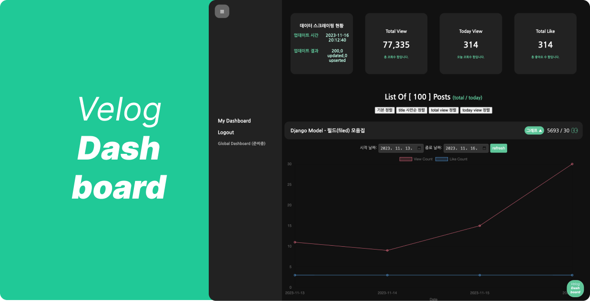

# Velog Dashboard Project

### "12월 중으로 레거시 통계 보기가 안정화 된 상태로 다시 제공" 된다고 하니, 그때 다시 살려보도록 하겠습니다!, [velog 글 보러가기](https://velog.io/@qlgks1/velog-dashboard-%EC%A0%9C%EC%9E%91%EA%B8%B0-3-frontend-1%EC%B0%A8-user-flow-test#12%EC%9B%94-%EC%A4%91%EC%9C%BC%EB%A1%9C-%EB%A0%88%EA%B1%B0%EC%8B%9C-%ED%86%B5%EA%B3%84-%EB%B3%B4%EA%B8%B0%EA%B0%80-%EC%95%88%EC%A0%95%ED%99%94-%EB%90%9C-%EC%83%81%ED%83%9C%EB%A1%9C-%EB%8B%A4%EC%8B%9C-%EC%A0%9C%EA%B3%B5-%EB%90%9C%EB%8B%A4%EA%B3%A0-%ED%95%98%EB%8B%88-%EA%B7%B8%EB%95%8C-%EB%8B%A4%EC%8B%9C-%EC%82%B4%EB%A0%A4%EB%B3%B4%EB%8F%84%EB%A1%9D-%ED%95%98%EA%B2%A0%EC%8A%B5%EB%8B%88%EB%8B%A4-%EC%95%84%EB%9E%98%EB%8A%94-%EC%98%88%EC%A0%95%EB%90%9C-%EC%9B%90%EB%9E%98-%EA%B8%80%EC%9E%85%EB%8B%88%EB%8B%A4--%EC%95%84%EC%89%AC%EC%9A%B4%EB%8C%80%EB%A1%9C-%EC%98%AC%EB%A0%A4%EB%B4%85%EB%8B%88%EB%8B%A4)

> velog dashboard project, **_velog의 모든 게시글, 통계 데이터를 한 눈에 편하게 확인하자!!_**   
> [https://velog-dashboard.kro.kr](https://velog-dashboard.kro.kr?utm=github)  
> 영상으로 보기! -> https://youtu.be/Ab8c4kmGhQA

## 1. HOW TO USE

#### [https://velog-dashboard.kro.kr](https://velog-dashboard.kro.kr?utm=github)

1. https://velog.io/ 에 접속해서 내 벨로그에 들어간다 (ex - https://velog.io/@qlgks1)

2. 개발자 도구 -> 어플리케이션 -> 쿠키 -> velog에서 `access_token` 값과 `refresh_token` 값을 확인한다!

3. 해당 값을 가지고 login을 한다!

4. ***`데이터 스크레이핑 batch` 가 최대 10분 텀으로 루프를 돕니다.*** 그렇기 때문에 최초 데이터 이니셜라이징에 시간이 소요될 수 있습니다.

5. 특히 게시글이 많은 경우, 오래된 게시글일 경우, retry로 데이터 스크레이핑을 해도 limit에 걸리는 경우가 있습니다. 이 경우 다음 데이터 스크레이핑 사이클에서 update가 되니, 기다려주시면 너무 감사드립니다.

6. 영상으로 보기! -> https://youtu.be/Ab8c4kmGhQA

7. post 에 있는 아이콘,  이미지는 전날 대비 상승,  이미지는 전날 대비 하락 입니다!

8. 다시 접속하실땐 login (index) page를 거치지 말고, 바로 [https://velog-dashboard.kro.kr/dashboard](https://velog-dashboard.kro.kr/dashboard?utm=github) 로 접근하면 편합니다!

9. 최초 로그인 이후, 다시 로그인 시도 하실때 `token issue` 로 고통받으신다면, 우측 하단에 채널톡으로 남겨주시면 제가 핸들링하겠습니다,, (아직 BETA 라 해당 부분은 조금 문제가 있습니다ㅠㅠ)

## 2. token 활용 사항과 사용하는 velog graphQL list

### 1) token 활용

- 입력한 token은 atlas cloud 로 제공되는 mongodb DBMS에 보관됩니다. network ip accesss 부터, auth 까지 모두 제한 환경이니 보안적 이슈는 mongodb사에 있습니다.
- 즉, mongodb cloud가 털리는 이슈까지가 아니라면 token이 탈취될 염려가 없습니다.
- 만약 그럼에도 불구하고 token 탈취의 의심이 있다면, token의 자체 refresh를 멈추고 폐기에 들어갑니다.
- **_식별이 가능한 개인정보를 수집하지 않습니다._** 수집하는 정보는 velog id (email) 이 unique 구분값을 위해 저장되며, 이는 token을 가지고 있는 제 3자에게 유출되지 않습니다.
- 마케팅 용도로 사용하지 않습니다. 만약 이메일 전송이 필요하다고 판단 된다면, 개개인에게 공지성 메일 이후 동의를 받고 진행하게 됩니다.

### 2) 사용하는 velog graphQL

1. `currentUser`

- velog url를 얻기 위해 사용합니다. `username` 만 가져오며, 그 외 값은 가져오지 않고 누구에게도 제공하지 않습니다.
- 토큰이 필요한 API 입니다.

2. `Posts`

- 해당 유저의 모든 게시글을 가져오기 위해 사용합니다. token이 필요없는 API 이며, 수정, 생성, 삭제 등의 모든 기능은 사용하지 않습니다. 오직 "READ" 만 사용합니다.
- 토큰이 필요하지 않은 API 입니다.

3. `getStats`

- 특정 post uuid 값을 기반으로 통계 데이터를 모두 가져옵니다.
- 토큰이 필요한 API 입니다.

---

## 3. Getting Started (local에서 직접 구축하기)

1. 먼저 mongodb atlas connction info가 필요합니다. - https://www.mongodb.com/atlas/database
2. `backend` 디렉토리로 이동합니다.
3. `.env.sample` file을 참조해 `.env` 를 만듭니다.
4. 해당 디렉토리의 root에서 `yarn` 으로 필요한 모든 라이브러리를 설치하고 `yarn start` 로 가동합니다.
5. 이제 static file을 열면 됩니다 -> `nginx > pages > index > index.html` 를 더블클릭으로 브라우저에서 열어주세요!
6. 로그인을 통해 정상적으로 유저 등록이되는지 체크합니다!
7. 이제 `worker` 로 이동해서 poetry를 활요해 필요한 라이브러리를 세팅합니다. - [poetry 간단 사용법](https://velog.io/@qlgks1/python-poetry-%EC%84%A4%EC%B9%98%EB%B6%80%ED%84%B0-project-initializing-%ED%99%9C%EC%9A%A9%ED%95%98%EA%B8%B0)
8. `.env.sample` file을 참조해 `.env` 를 만듭니다.
9. `main.py` 를 러닝해서 데이터 스크레이핑을 확인합니다. 로깅은 console stream과 file stream 모두 존재합니다!
10. `token_refresh.py` 로 저장된 user token을 refresh 해줍니다!

## 4. 참조

- [프로젝트 진행 기록 - velog](https://velog.io/@qlgks1/velog-dashboard-%EC%A0%9C%EC%9E%91%EA%B8%B0-%EB%B2%A8%EB%A1%9C%EA%B7%B8-%ED%86%B5%EA%B3%84%EB%A5%BC-%ED%8E%B8%ED%95%98%EA%B2%8C-%EB%B3%B4%EA%B3%A0-%EC%8B%B6%EC%96%B4%EC%9A%94-%E3%85%A0)
- [mongodb cloud - atlas](https://www.mongodb.com/atlas/database)
- [poetry 간단 사용법](https://velog.io/@qlgks1/python-poetry-%EC%84%A4%EC%B9%98%EB%B6%80%ED%84%B0-project-initializing-%ED%99%9C%EC%9A%A9%ED%95%98%EA%B8%B0)
- [aiohttp_retry](https://github.com/inyutin/aiohttp_retry)
- 도커라이징 없이, nginx 온프램 배포시 index 페이지를 위해 `ln -s ./index/index.html index.html`
